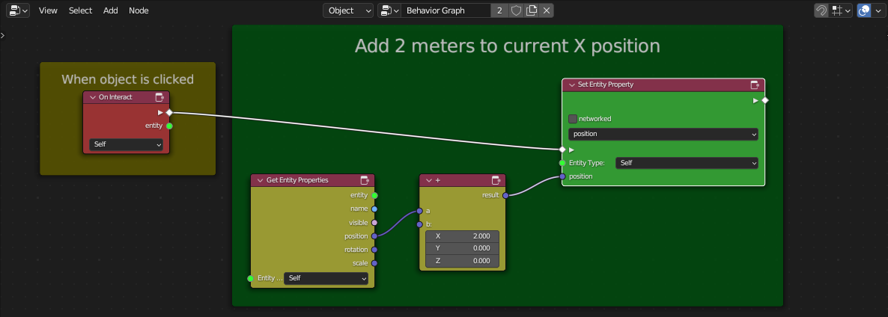
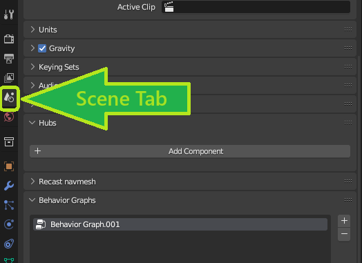
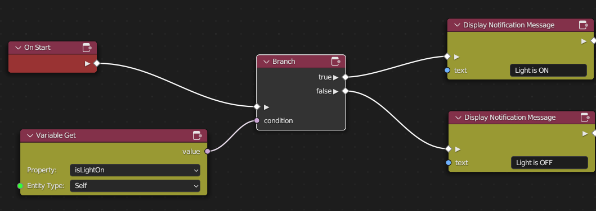
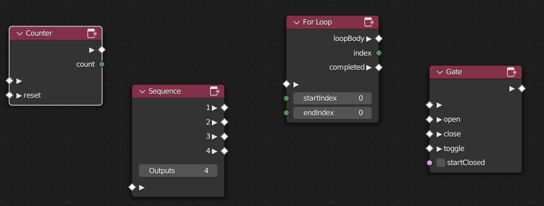
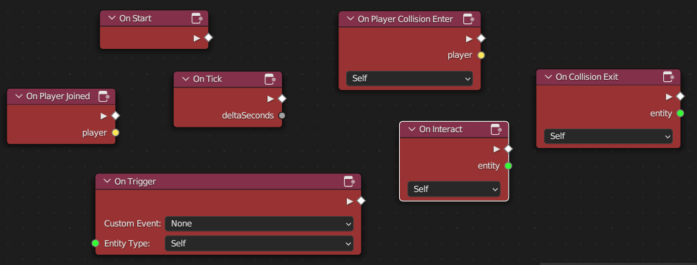
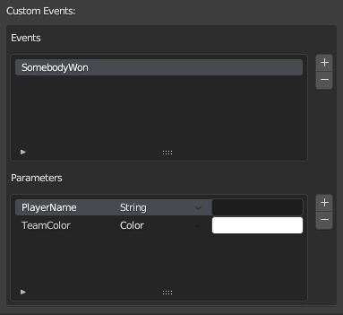
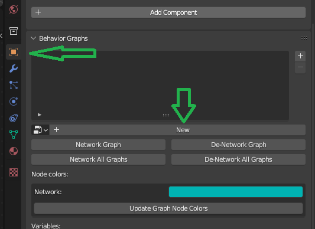
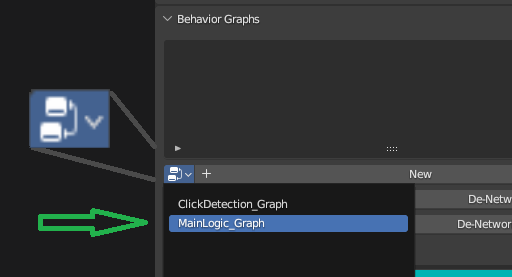
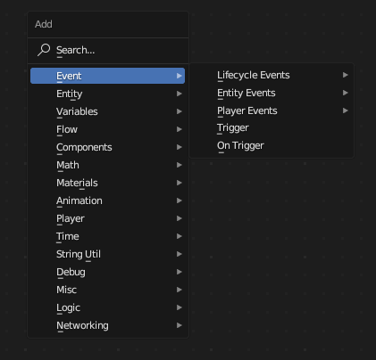

> **NOTE:** _As of this documentation being created, Behavior Graphs are undergoing rapid development. This has the effect of making it challenging to update this documentation quickly enough to make sure it has parity with the current state of the tech behind it. Thank you for your patience and please consider contributing edits to this documentation as needed._

If 3d models represent the visual and aesthetic side of an experience in Hubs, Behavior Graphs represent the design of the affordances (interactive possibilities) and any sequence(s) of events that might occur within that experience.

Behavior graphs allow for control over many aspects of a Hubs experience by exposing Hubs-specific features normally only accessible via altering the Hubs code base. Things like teleporting, audio zones, video playback, or in-world events like when a person joins or leaves a room can all be accessed through a graphical system of connected nodes or blocks (like a flowchart) from within Blender.

\
_An example of a simple **Behavior Graph** that moves an object 2 meters each time it's clicked._

They may also be used to control aspects of the visual elements within a scene such as the lighting, an object’s material properties, the speed of an animation, or an object's position/rotation/scale to name just a few.

All of the logic created within the Blender scene gets exported along with everything else. This is powerful because a single `.glb` file can contain all of the instructions for how it should behave. _Having self-contained behaviors allows for modular design._ For example, a lamp model could contain everything it needs to be interacted with--switched on/off, dimmed, colored, or even broken. Any copy of the lamp could be interacted with the same way.

The logic involved in setting up these behaviors can be as simple as a video appearing when a button is pressed or as complex as an escape room filled with interdependent puzzles where the whole room animates on cue. Whatever you choose to create, the logic comes from basic (and sometimes familiar) building blocks like _if/then_ statements, variables, and math functions.

In understanding how Behavior Graphs work, it can be helpful to think of the various nodes as simple building blocks. On its own, an individual node is usually pretty simple and doesn’t do very much. But by combining nodes into larger, more complex graphs, the result can be quite sophisticated. This is not unlike programming where basic functions combine to create new, complex systems.

\
_A random sampling of Behavior Graph nodes. Each node usually performs a relatively simple function. Combining nodes is how complex interactions are made._

While behavior graphs are not intended to replace code modifications, in some cases it may make more sense than forking the Hubs code base just to create a simple interaction or minor modification to an experience. Behavior graphs also serve artists and designers, many of whom may have very little to no experience with coding, by introducing them to the ways in which the Hubs runtime environment functions.

Behavior Graphs also offer an opportunity to experiment and prototype an idea that might otherwise require a lot of work (forking, coding, building, etc.) only to discover the idea wasn’t viable to begin with. For example, a novel control scheme or an alternative camera view might be attempted with behavior graphs, tested, then later reworked in code after the idea is proven fruitful.

---

# How Behavior Graphs Work

First of all, if you happen to have experience with a visual node-based system such as those within a game engine, you will likely find Behavior Graphs relatively easy to learn. It is worth noting that although the Behavior Graph editor looks similar to Blender's other node-based editors (_Shaders, Compositor, Geometry Nodes_), they have some unique characteristics that are necessary to understand.

This introduction to Behavior Graphs is intended to serve as an overview of the system rather than a step-by-step guide on their use. The following section explains the various parts that comprise Behavior Graphs and how they work together.

# Graph Types

There are conceptually two types of Behavior Graphs, but the distinction has more to do with **how/where they are used** rather than anything functionally different about them.

### Object Graph

**Object Graphs** are the main type you will encounter. An **Object Graph** refers to a Behavior Graph that is placed on a particular **Object** (otherwise known as an **_Entity_**, a term that gets used a lot in the context of graphs).

A single object might have several Behavior Graphs assigned to it. And the same Object Graph might be assigned to multiple objects. Because of this, when using nodes in an Object Graph, there is a concept of **self-reference to the object itself**.

By having a universal **_Self_** value, an Object Graph can act universally on objects. In other words, by referring to **Self**, there is no need to explicitly point to a specific entity (object).

\
_Having a built-in **Self** reference means this graph could work when put on any object. Now anything with this graph glows for a moment after clicking it._

Object Graphs can still refer to entities explicitly if you choose. The **Self** reference is there to avoid having to make potentially countless identical graphs with their only difference being which entities they reference.

### Scene Graph

Within the Blender's **Properties Panel**, in the **Scene Tab**, you can add a **Behavior Graph** to the list. This graph would now be referred to as a **Scene Graph** because of where it is located. Any graphs put here operate at the _Scene_ level. Having a scene-level graph allows you to organize the logic between entities in one place.

\
_The **Scene Tab** in Blender is where you can add **Scene Graphs** if you choose._

The main difference with **Scene Graphs** is that instead of the concept of **Self**, it uses the term **Scene** as a replacement.

Anywhere an Object Graph would have a **Self** reference is replaced by **Scene** for clarity. In cases where this would not make sense, fields will default to the _Entity Type_ called **Other**, where you must explicitly select an entity.

\
_On the **Scene Graph**, notice the **Scene** reference replaces the **Self** reference that Object Graphs have._

It doesn't always make sense to use a **Scene Graph** and, in some cases, it can be more flexible to use an object from the scene to act as a 'holder' or container for graphs that handle overarching logic. Each use case is different so experimenting is key. Since you can copy nodes from one graph to another, it's relatively easy to try different approaches to how you organize your logic.

> Side note: **'Graph-based' context**:\
> You will sometimes see a third type of context called **Graph**. This
> exists mostly as a matter of convenience for when you have the need for a Variable or Custom Event (see details below), but you only need to refer to them **within the context of the Behavior Graph they are in**. In this case, you may create a **Graph-based** Variable or Custom Event. This can be done within the **side panel** (hotkey `n`) while inside the **Behavior Graph Editor**. Variables and Custom Events made here will appear in nodes as Entity Type: **Graph** > \
> _Making a Variable within the **Graph context** makes that variable accessible to ONLY the graph it's in. This variable would **not** be exposed to other graphs, even ones on the same object._

### Flow

The core functionality of a Behavior Graph is defined by the **Flow** of information from one node to the next. This **Flow line** is indicated by a **white** wire or connection and always flows (conceptually, anyway) **left to right**.

The Flow line connects the **Flow Input** and **Flow Output** of various nodes. Not every node has these kinds of inputs and outputs so when you see one that does, that indicates the node **performs some kind of _action_ or _operation_.**

\
*Three nodes connected by a Flow line via **Flow Inputs** and **Flow Outputs**. The data flows from **left to right**. These *Display Notification Message* nodes have **Flow Inputs** because they **do** something.*

Understanding how data flows through the graph is fundamental to designing, understanding, and debugging when things don't go as expected.

Some nodes, specifically referred to as **Flow Nodes** exist solely to handle this flow of information. They often act as a way to branch or otherwise divert the flow of data so that operations occur under certain conditions or at a certain time relative to other operations.

This control over **Flow** allows multiple operations to happen sequentially or in parallel, allowing more complex interactions.

\
_The `Branch` flow node checks for some **condition** and diverts the flow depending on whether the condition is **true** or **false**._

\
_Some examples of **Flow Nodes**. These tend to have several inputs and outputs and are often used together as the main way to control logic._

A full list of _Flow Nodes_ can be found on the **nodes list document placeholder link**

### Events

A Behavior Graph's Flow line has to start somewhere and that is always some **event**.
An **event** is anything that starts the flow of information. But the most common events are usually prompted by some user's action such as a mouse click or moving into some defined location that acts as a trigger for the **event**.

\
_Several **Event Nodes**. **Event** nodes start the flow of logic and, thus, usually do not have inputs._

For Hubs, there are some pre-defined events such as when a video starts playing that can be accessed through their own special nodes.

A full list of **Events** can be found on the **Events list document placeholder link**

### Variable Set / Variable Get

Just like in programming with code, it can be helpful (and even necessary) to store information throughout a graph so that you can recall it later for another purpose. For example, you might have a **variable** called _CookiesClicked_ (likely an integer, i.e. a non-decimal number) that you **set** whenever a new user joins.

\
_A list of **variables** that can be accessed by Behavior Graphs. A **variable** has a **type** that defines how it can be used._

In the example above, storing _CookiesClicked_ would allow you to **get** that **variable** later when you want to display how many people joined or when you need to calculate how many more players you need for something.

So you're often doing a `Variable Set` in one place, while using `Variable Get` somewhere else in the graph--or in a different graph altogether.

And in many common cases, you'll use `Variable Get` in conjunction with `Variable Set` by doing some basic math like in this example image:

\
_Follow the numbers to understand the flow of things. This graph is the equivalent of a common programming pattern: `CookiesClicked=CookiesClicked + 1` or the shorter `CookiesClicked += 1`. In other words, whenever the **Cookie is clicked**, it will **add 1** to our integer **variable** called **'CookiesClicked'**._

### Supported Variable Types

The following are supported **Variable Types** and their associated **Input**/**Output socket colors** in Behavior Graphs:

-  Boolean
-  Float
-  Integer
-  String
-  Vector3
-  Animation Action
-  Entity
-  Color
-  Material

Details about specific variable types can be found on the **Variable Types document placeholder link**

Each **Variable Type** has a color associated with its **Inputs** and **Outputs**

### Get / Set Component Property

For objects that have Hubs components attached to them, there are a couple nodes that allow you to operate on a component called `Get Component Property` and `Set Component Property`.\
These nodes are useful because they universally give you access to most editable components without the need for individual unique nodes that would only serve a single function. It also means that any new components that get added to the system can be accessed the same way.

\
_When you add a component to an object, such as the **Rigidbody** component, it can be accessed from the `Get Component Property` and `Set Component Property` nodes. The fields automatically populate with whatever data is exposed in the component, in this case, **Mass**._

In the above example, you can imagine how cumbersome it might be to have separate nodes for all of those rigidbody properties--(_Get Mass, Get Body Type, Get Gravity, etc..._). That list alone contains 11 different properties (with more to come!) Having a universal way to access Hubs components helps keep graphs from becoming a tangled mess as well.

### Other node types

Most nodes don't actually **do** anything on their own, hence their lack of **Flow Inputs**/**Outputs**. What they have, instead, are inputs and outputs related to the _type of data_ they work with.

For example, let's take one of the _Math_ nodes as an example, in this case, `Add`.

The `Add` node, relies on the attached nodes to operate. So it's not until `Variable Set` is triggered that the `Add` does its operation, when `Variable Set` is looking for an _input_ value.

\
_Many nodes, such as the various **Math** nodes act as a utility to do calculations or otherwise manipulate data._

### Custom Events

Sometimes, while triggering things to happen within a graph or between graphs, it can be useful to create a **Custom Event**. A **Custom Event** is just a signal that acts like a trigger to start a flow of logic. These can also have **Parameters** attached to them so that you can send data along with the **Custom Event**.\
For example, you might have a clickable object where you not only want to know _when_ it was clicked, but also _who clicked it_. The player data could be sent along with the **Custom Event** so that it can be passed along to some other node(s).

\
_Here, we have a **Custom Event** called _'SomebodyWon'_ that has two parameters, _'PlayerName'_ and _'TeamColor'_._

In a Behavior Graph, a `Trigger` node lets you trigger the **Custom Event** and input any **Parameters** you want to pass along with the event.

\
_A `Trigger` node showing a **Custom Event** called _'SomebodyWon'_. The two **Parameters** ('PlayerName' and 'TeamColor') show up as inputs on the `Trigger` node._

Elsewhere, you can use an `On Trigger` event to initiate some new flow of logic where you use the **Parameters** for other things. In this example, we've passed along _'PlayerName'_ and _'TeamColor'_ with our _'SomebodyWon'_ **Custom Event**.

\
_An `On Trigger` event node using our 'SomebodyWon' **Custom Event** and its **Parameters** to set the **Color** and **Text** properties of a Text component. (A **Concat** node is used to append ' is the winner!' to the user's PlayerName before it gets displayed at text.)_

In the image above, you can see how the **Parameters** show up as _outputs_ on the `On Trigger` node. In the example, the _'TextColor'_ is used to set the color of a Text component while _'PlayerName'_ is used to set the Text component's _'Text'_ property.

---

## Working with Behavior Graphs

### Behavior Graph Editor

Behavior Graphs have their own editor in Blender, unsurprisingly called the **Behavior Graph Editor**. This editor can be accessed from any window by using the **Editor Type** button found in the upper left of most windows in Blender:

\
_The **Behavior Graph Editor** can occupy most windows in Blender by changing the **Editor Type** in the menu where all the other editors are accessed._

The **Behavior Graph Editor** works similarly to other node-based editors in Blender such as the _Shader Editor_ or the _Geometry Node Editor_.

The editor doesn't allow you to do much of anything until you **create a new Behavior Graph**. This is done by:

First **selecting some object in your scene**, then either:

1. Pressing the **New** button at the top center of the **Behavior Graph Editor**

\
 **-OR-** 2. Opening the **Object Properties**, going to the **Object** tab, scrolling to the **Behavior Graph** section and clicking the **New** button.

Once a **Behavior Graph** is created, it can be assigned to other objects (or changed to a different graph) as well via the **Browse Node Tree** button, usually found next to wherever graphs are listed.

\
_Behavior Graphs can be assigned to new objects, or changed to a different graph._

The **Behavior Graph** can be renamed by clicking on its name in most fields where it appears. Making meaningful names for graphs is essential for keeping things organized.

**A single object can have multiple Behavior Graphs assigned to it.** This helps when organizing the structure of your logic so that various functions can be more modular in their design. For example, an object might have one graph that handles visual changes (like a material color) while another graph on the object handles the object's movement. You might then have another graph that handles input events that the other graphs listen for. Keeping functionality separate can avoid confusion and dependency problems.

> Knowing when to separate functions into separate behavior graphs requires some experimentation since, like text-based programming or scripting, there are many valid ways to organize code. But as you experiment you will likely find intuitive design patterns that tend to get repeated.
> For example, making use of the _'Self'_ context of nodes to make behaviors that are universal no matter what kind of object they are applied to.

### Adding/Deleting Nodes

Once a **Behavior Graph** has been created, nodes can be created by using the **Add** menu (or the typical `Shift`+`a` shortcut).

\
_A list of **node types** appears when using the **Add** menu._

> **NOTE:** *The node types may likely change over time as the Behavior Graph system matures. For example, all of the many *Math* nodes may end up being consolidated into a single, universal *Math* node. This is important to remember if you see something missing that was once in this list.*

### Manipulating Nodes

Nodes can be moved around using the typical Blender controls for similar editors, namely the _move_ tool.

Nodes may also be resized by dragging their edges, which you may find useful when using long object or variable names that might be difficult to read when a node is small.

Muitple nodes can be selected at once by `Shift`-clicking or by dragging a selection box around them. The selection tools are found in the _Tools_ menu, by pressing `t` in the editor.

When selecting multiple nodes simultaneously, you may also use _rotate_ and _scale_ to maniuplate their juxtapositions to one another. These are often overlooked but can help to 'spread out' nodes that are clustered too closely to decipher easily.

Since the editor itself is a sort of 'infinite canvas', nodes can get lost fairly easily. Pressing `a` to select all nodes, then **Frame Selected** from the **View** menu to focus on them helps to reorient your view. You may also use **Frame All** from the same menu.

To **delete a node**, you can select the node(s) and press `x`.

Nodes may also be **cut**, **copied**, and **pasted** using standard hotkeys.

> ### **THINGS TO LOOK OUT FOR:**
>
> - Deleting a node that is connected to other nodes will sever any and all connections.
> - Pressing `m` on a node to **mute** as other editors allow does _not_ actually stop the node from activating. In other words, it only provides a visual 'mute' in the editor but not at export or runtime. There are currently no plans to support 'muting' but that may change.
> - Sometimes node wires, especially **Flow** lines can get attached to the wrong inputs on a node, such as a _float_ or _entity_ input. This will cause errors on export, but not always. This is considered a bug and will hopefully be fixed in the near future.
> - **Flow** lines that are connected to _Reroute_ nodes and nothing else (aka, a disconnected flow line) will cause errors on export and/or runtime.
> - If a node ever appears to be missing some input or output, especially when using Custom Events or Variables, you can usually correct it by remaking the node or by changing one of its fields temporarily until the inputs/outputs show up again. This is a bug that will hopefully get fixed in the near future.
